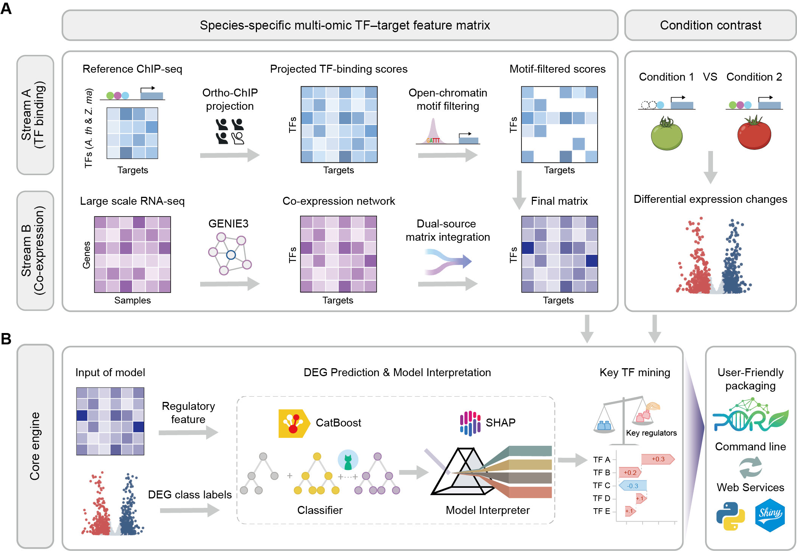
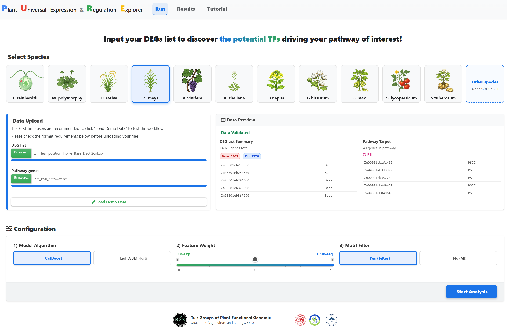

# PURE: Plant Universal Expression and Regulation Explorer

**PURE** is an interpretable framework designed to construct Gene Regulatory Networks (GRNs) and identify key transcription factors (TFs) in plants. 

By integrating **co-expression patterns**, **sequence motifs**, and **orthology-projected *in vivo* binding evidence**, PURE overcomes regulatory data sparsity in non-model species. It employs interpretability-first machine learning (CatBoost + SHAP) to decode transcriptomic programs, allowing researchers to prioritize high-confidence regulators governing stress responses, development, and specific metabolic pathways.

<p align="center">
  
</p>

---

## Installation

PURE consists of three core Python scripts (`PURE_Data_Process.py`, `PURE_CatBoost_SHAP.py`, `PURE_Contribution_Visualization.py`) located in the “Script/“ directory. 

We recommend managing dependencies via Conda/Mamba using the provided configuration file (PURE_env.yml).

**1. Clone the repository:**

```bash
git clone https://github.com/tulab-sjtu/PURE
```

**2. Create the environment:**

Bash

```bash
conda env create -f Script/PURE_env.yml
conda activate PURE_env
```

------

## Usage

### 1. Data Processing Module (`PURE_Data_Process.py`)

This module constructs the regulatory feature matrix by integrating co-expression networks with Ortho-ChIP projection.

#### Option A: Run from Raw Data

```bash
python Script/PURE_Data_Process.py \
    --out_prefix O_sativa_TF_regulatory_raw \
    --threads 48 \
    --target_genome_config Example_data/1_process_Example_data/0_O_sativa_genome.config \
    --target_tf_list Example_data/1_process_Example_data/0_Os_TF_list_itak.txt \
    --coexpr_chip_motif "0.5,0.5,Y" "0.5,0.5,N" "0,1,Y" "1,0,Y" "0,1,N" "1,0,N" \
    --rna_matrix Example_data/1_process_Example_data/1_Os_RNA-seq_TPM_matrix_10sample.tsv \
    --genie3_filter "q10" \
    --atac_peak_config Example_data/1_process_Example_data/2_Os_At_Zm_ATAC.config \
    --chip_ref_genome_config Example_data/1_process_Example_data/2_At_Zm_genome.config \
    --chip_peak_config Example_data/1_process_Example_data/2_At_Zm_peaks_path_q005.config \
    --blast_evalue 1e-20 \
    --motif_list Example_data/1_process_Example_data/3_Motif_family.config \
    --motif_file Example_data/1_process_Example_data/3_DAP_ChIP_motifs.meme \
    --motif_scan_pvalue 1e-4 \
    > Osativa_TF_regulatory_raw.log 2>&1 &

# GENIE3 Filter: Top 10% links (q10) or Top 100k links (100k) to reduce noise
# Weight strategy: "Co-expr_Weight, ChIP_Weight, Use_Motif(Y/N)"
# Example: "0.5,0.5,Y" means equal weight for Co-expr and ChIP, filtered by Motif.
⚠️ CRITICAL CONFIGURATION STEP: Before running the pipeline, you MUST edit all referenced configuration files (*.config). Ensure that the internal file paths point to your actual local Genome FASTA, GFF3 Annotations, ChIP-seq Peaks, and ATAC-seq Peaks. The paths in the example configs are placeholders and need to be replaced with your real file locations.
```

#### Option B: Run from Intermediate Files (Mid-Mode)

Use this if you already have GENIE3 or BLAST results and want to retune integration parameters.

```bash
# Pre-computed GENIE3 file & BLAST result for Ortho-ChIP projection
python Script/PURE_Data_Process.py \
    --out_prefix O_sativa_TF_regulatory_mid \
    --threads 48 \
    --target_genome_config Example_data/1_process_Example_data/0_O_sativa_genome.config \
    --target_tf_list Example_data/1_process_Example_data/0_Os_TF_list_itak.txt \
    --coexpr_chip_motif "0.5,0.5,Y" "0.5,0.5,N" "0,1,Y" "1,0,Y" "0,1,N" "1,0,N" \
    --genie3_file Example_data/1_process_Example_data/1_O_sativa_TF_regulatory_GENIE3_q10_normalization.tsv \
    --atac_peak_config Example_data/1_process_Example_data/2_Os_At_Zm_ATAC.config \
    --chip_ref_genome_config Example_data/1_process_Example_data/2_At_Zm_genome.config \
    --chip_peak_config Example_data/1_process_Example_data/2_At_Zm_peaks_path_q005.config \
    --blast_result_file Example_data/1_process_Example_data/2_O_sativa_TF_regulatory_blast_relationship.tsv \
    --motif_list Example_data/1_process_Example_data/3_Motif_family.config \
    --motif_file Example_data/1_process_Example_data/3_DAP_ChIP_motifs.meme \
    --motif_scan_pvalue 1e-4 \
    > Osativa_TF_regulatory_mid.log 2>&1 &
```

### 2. Prediction & Interpretation Module (`PURE_CatBoost_SHAP.py`)

This module predicts Differentially Expressed Genes (DEGs) and calculates TF contributions using SHAP.

```bash
python Script/PURE_CatBoost_SHAP.py \
    --out_prefix Os_zt4h_vs_zt20h_Result \
    --threads 48 \
    --h5_key "/regulons" \
    --TF_features Example_data/2_catboost_Example_data/O_sativa_TF_regulatory.h5 \
    --n_splits 10 \
    --iterations 1500 \
    --learning_rate 0.03 \
    --depth 6 \
    --l2_leaf_reg 3.0 \
    --auto_class_weights "Balanced" \
    --DEGs Example_data/2_catboost_Example_data/Os_zt4h_vs_zt20h_DEG_2col.csv \
    > Os_zt4h_vs_zt20h_CatBoost.log 2>&1 &
 
 # HDF5 key for the regulatory matrix (default is /regulons) (Generated from Step 1)
 # --auto_class_weights: Automatically balance weights for pos vs neg genes
 # --DEGs: Target Label: 2-column CSV (GeneID, Label)
```

### 3. Visualization Module (`PURE_Contribution_Visualization.py`)

**Turn your SHAP matrices into publication-ready figures.** This module is not just for plotting; it allows you to zoom in on **specific pathways or genes of interest**, transforming raw scores into biologically meaningful insights (e.g., Photosynthesis pathways, Stress response modules).

```bash
python Script/PURE_Contribution_Visualization.py \
    --out_prefix Os_LvsD_SHAP_Plots \
    --contribution_matrix Example_data/3_visualization_Example_data/Os_LvsD_SHAP_exp_0.1121_pos_is_Light_neg_is_Dark.csv \
    --filter_percent 20 \
    --target_tf_list Example_data/3_visualization_Example_data/0_Os_TF_list_itak.txt \
    --pathway_config Example_data/3_visualization_Example_data/Os_PS_LHC_genes.config \
    --best_hit_to_model_species Example_data/3_visualization_Example_data/Os2At_besthit.blast \
    --heatmap_expression Example_data/3_visualization_Example_data/Os_zeitgeber_TPM.tsv \
    --model_species_annotation Example_data/3_visualization_Example_data/At_annotation.config \
    > Os_LvsD_SHAP_vis.log 2>&1 &

# --filter_percent: Retains only the top 20% of interactions to focus on high-confidence regulatory signals
# --pathway_config: Focus visualization on specific biological pathways
# --heatmap_expression: Get expression pattern of your interested genes and key TFs
# --best_hit_to_model_species & --model_species_annotation: Map TFs to a model species for functional annotation and readable naming
```

------

## Web Service

For researchers who prefer a graphical interface or lack computational resources, PURE is accessible as a comprehensive web resource (https://plantencodedb.sjtu.edu.cn/pure/). The web platform allows experimental biologists to bypass computational barriers and directly prioritize high-confidence regulators for downstream functional verification.


