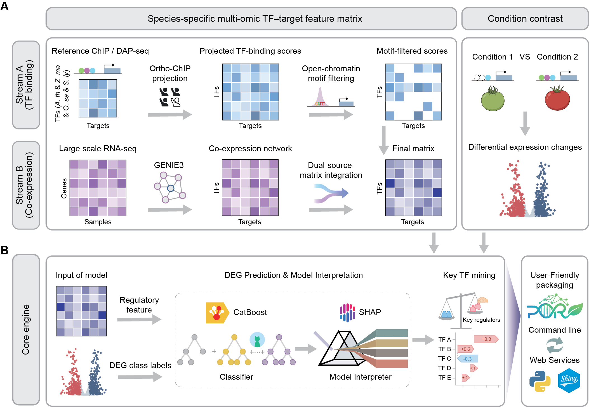
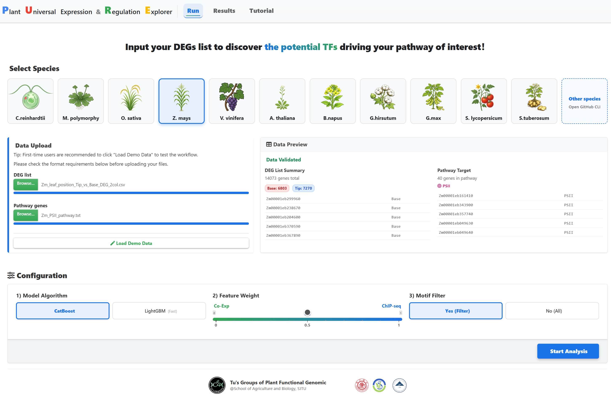

# PURE: Plant Unified Regulation Explorer

PURE is an interpretable machine-learning workflow for constructing plant TF–target feature matrices and prioritizing transcription factors associated with differential gene expression. It integrates condition-specific co-expression, cross-species TF-binding evidence, motif support, chromatin accessibility, and CatBoost/TreeSHAP analysis.

<p align="center">
  
</p>

## Workflow

PURE provides three command-line modules:

1. **Data processing** builds species-specific regulatory feature matrices from RNA-seq or a precomputed GENIE3 network, reference ChIP-seq/DAP-seq peaks, protein homology, accessible chromatin, and motifs.
2. **CatBoost/TreeSHAP analysis** evaluates DEG classification and ranks TF features using evidence-filtered SHAP attribution, with repeated-CV and bootstrap stability summaries.
3. **Contribution visualization** produces pathway-level TF summaries, heatmaps, and network-oriented plots.

SHAP values are model contributions in raw-margin space. Their signs indicate movement toward or away from the encoded class 1; they do not by themselves indicate biological activation or repression.

## Installation

```bash
git clone https://github.com/tulab-sjtu/PURE.git
cd PURE
conda env create -f Script/PURE_env.yml
conda activate PURE_env
```

The data-processing workflow uses the following external commands when the corresponding steps are run:

- `Rscript` with `argparse`, `GENIE3`, and `data.table`
- `bedtools`
- `fimo` from MEME Suite
- `makeblastdb` and `blastp`, or `diamond`

Extract the example data before running the examples:

```bash
tar -xzf Example_data.tar.gz
```

## Repository Contents

```text
Script/
  PURE_Data_Process_v3.py                 Regulatory matrix construction
  PURE_CatBoost_SHAP_v3.py                DEG classification and TF attribution
  PURE_Contribution_Visualization.py      Pathway-level visualization
  PURE_env.yml                            Conda environment

Example_data.tar.gz                       Reproducible example inputs
Expression_rawdata_accession_for_PURE.csv RNA-seq accessions used by PURE
Figures/
  PURE_diagram.png
  PURE_Web.png
```

## Module 1: Regulatory Matrix Construction

### Required input formats

All configuration files are tab-delimited.

**Target or reference genome configuration**

```text
SpeciesID    GenomeFASTA    AnnotationGFF3    ProteinFASTA
```

**Target TF list**

```text
TFGeneID    TFFamily
```

**Expression matrix**

The first column contains gene IDs; all remaining columns contain numeric expression values such as TPM or normalized counts.

```text
GeneID    Sample1    Sample2    Sample3
GeneA     12.4       9.1        15.0
GeneB     0.0        1.2        0.8
```

GENIE3 is run on `log2(expression + 1)`. A precomputed three-column GENIE3 table can be supplied with `--genie3_file` instead.

**Reference TF-binding peak configuration**

```text
ReferenceSpeciesID    ReferenceTFGeneID    TFName    TFFamily    PeakFile
```

Peak files must use a narrowPeak-compatible layout. PURE reads genomic coordinates from columns 1–3, signal from column 7, and summit offset from column 10.

**Accessible-chromatin configuration**

```text
SpeciesID    AccessibleRegionBED
```

Accessible regions may be derived from ATAC-seq or DNase-seq. Entries are required for the target species and selected reference species used in the run.

**Motif-family mapping**

```text
MotifID    TFFamily
```

`--motif_file` must be a MEME-format motif file.

### Preflight check

Run a non-destructive validation before a full analysis:

```bash
python Script/PURE_Data_Process_v3.py \
  --out_prefix O_sativa_TF_regulatory \
  --out_dir Results/O_sativa_process \
  --threads 48 \
  --dry_run \
  --target_genome_config Example_data/1_process_example_data/0_O_sativa_genome.config \
  --target_tf_list Example_data/1_process_example_data/0_Os_TF_list_itak.txt \
  --rna_matrix Example_data/1_process_example_data/1_Os_RNA-seq_TPM_matrix_10sample.tsv \
  --genie3_filter q10 \
  --genie3_top_scope global \
  --chip_ref_genome_config Example_data/1_process_example_data/2_At_Zm_genome.config \
  --chip_peak_config Example_data/1_process_example_data/2_At_Zm_peaks_path_q005.config \
  --chip_species A_thaliana,Z_mays \
  --atac_peak_config Example_data/1_process_example_data/2_Os_At_Zm_ATAC.config \
  --homology_vote_threshold 0.5 \
  --homology_signal_aggregation max \
  --aligner blast \
  --alignment_evalue 1e-20 \
  --motif_list Example_data/1_process_example_data/3_Motif_family.config \
  --motif_file Example_data/1_process_example_data/3_DAP_ChIP_motifs.meme \
  --motif_scan_pvalue 1e-4 \
  --coexpr_chip_motif "0.5,0.5,Y" "0.5,0.5,N" "0,1,Y" "1,0,Y"
```

Remove `--dry_run` to execute the workflow.

### Using precomputed intermediates

```bash
python Script/PURE_Data_Process_v3.py \
  --out_prefix O_sativa_TF_regulatory \
  --out_dir Results/O_sativa_process \
  --threads 48 \
  --target_genome_config Example_data/1_process_example_data/0_O_sativa_genome.config \
  --target_tf_list Example_data/1_process_example_data/0_Os_TF_list_itak.txt \
  --genie3_file Example_data/1_process_example_data/1_O_sativa_TF_regulatory_GENIE3_q10_normalization_1M.tsv \
  --chip_ref_genome_config Example_data/1_process_example_data/2_At_Zm_genome.config \
  --chip_peak_config Example_data/1_process_example_data/2_At_Zm_peaks_path_q005.config \
  --chip_species A_thaliana,Z_mays \
  --atac_peak_config Example_data/1_process_example_data/2_Os_At_Zm_ATAC.config \
  --alignment_result_file Example_data/1_process_example_data/2_O_sativa_TF_regulatory_blast_relationship_500K.tsv \
  --homology_vote_threshold 0.5 \
  --homology_signal_aggregation max \
  --motif_list Example_data/1_process_example_data/3_Motif_family.config \
  --motif_file Example_data/1_process_example_data/3_DAP_ChIP_motifs.meme \
  --motif_scan_pvalue 1e-4 \
  --coexpr_chip_motif "0.5,0.5,Y" "0.5,0.5,N" "0,1,Y" "1,0,Y"
```

### Principal parameters

| Parameter | Description |
| --- | --- |
| `--out_prefix` | Prefix for generated files. |
| `--out_dir` | Directory for all outputs. |
| `--dry_run` | Validate inputs, output paths, dependencies, and parameter combinations without running the pipeline. |
| `--rna_matrix` / `--genie3_file` | Raw expression matrix or precomputed GENIE3 links. One is required. |
| `--genie3_filter` | GENIE3 link filter, for example `q10` or `50k`. Default: `q20`. |
| `--genie3_top_scope` | Apply GENIE3 filtering globally, within each TF, or within each target: `global`, `per_tf`, or `per_target`. Default: `global`. |
| `--chip_species` | Comma-separated reference species retained from the binding-resource configuration. |
| `--homology_vote_threshold` | Minimum pooled fraction of binding-supported reference TF homologs required to transfer an interaction. Default: `0.5`. |
| `--homology_signal_aggregation` | Aggregate transferred binding signals with `max`, `median`, or `weighted_mean`. Default: `max`. |
| `--aligner` | Protein-similarity backend: `blast` or `diamond`. |
| `--alignment_result_file` | Precomputed `query`, `subject`, `percent_identity` table. Alias: `--blast_result_file`. |
| `--coexpr_chip_motif` | One or more `CoexpressionWeight,BindingWeight,Y/N` settings. |

For `weighted_mean`, PURE weights each transferred observation by the geometric mean of the direct TF-homology and target-homology percent identities. Observations without both direct relationships are not assigned an inferred weight.

`--coexpr_chip_motif` examples:

- `"0.5,0.5,Y"`: equal co-expression and projected-binding weights with motif filtering
- `"1,0,N"`: co-expression only
- `"0,1,Y"`: motif-filtered projected binding only

HDF5 matrices are written with key `/regulons`. Typical outputs include the calculated or supplied GENIE3 network, processed reference binding targets, protein alignments, projected binding targets, motif-filtered links, and one HDF5 matrix per requested evidence setting.

## Module 2: CatBoost and TreeSHAP

```bash
python Script/PURE_CatBoost_SHAP_v3.py \
  --out_prefix Results/Os_zt4h_vs_zt20h \
  --threads 48 \
  --h5_key /regulons \
  --TF_features Example_data/2_catboost_example_data/O_sativa_TF_regulatory.h5 \
  --DEGs Example_data/2_catboost_example_data/Os_zt4h_vs_zt20h_DEG_2col.csv \
  --performance_splits 5 \
  --stability_splits 10 \
  --stability_repeats 5 \
  --stability_bootstraps 30 \
  --stability_seed 42 \
  --iterations 1000 \
  --learning_rate 0.05 \
  --depth 6 \
  --l2_leaf_reg 3.0 \
  --auto_class_weights Balanced
```

The DEG file is an index-oriented two-column CSV:

```text
GeneID,Label
GeneA,1
GeneB,0
```

The script requires exactly two non-missing label classes. `--performance_splits` controls the held-out classification evaluation; `--stability_splits` and `--stability_repeats` control repeated out-of-fold SHAP stability analysis. Bootstrap refits are controlled by `--stability_bootstraps`. Use `--skip_stability` when only the final model and standard performance outputs are required.

Outputs include fold-level classification metrics, ROC curves, raw and evidence-filtered SHAP matrices, TF rank-stability tables, empirical percentile intervals across refits, agreement diagnostics, a run manifest, and a PDF stability report.

## Module 3: Contribution Visualization

```bash
python Script/PURE_Contribution_Visualization.py \
  --out_prefix Results/Os_LvsD_SHAP_Plots \
  --contribution_matrix Example_data/3_visualization_example_data/Os_LvsD_SHAP_exp_0.1121_pos_is_Light_neg_is_Dark.csv \
  --filter_percent 20 \
  --target_tf_list Example_data/3_visualization_example_data/0_Os_TF_list_itak.txt \
  --pathway_config Example_data/3_visualization_example_data/Os_PS_LHC_genes.config \
  --best_hit_to_model_species Example_data/3_visualization_example_data/Os2At_besthit.blast \
  --heatmap_expression Example_data/3_visualization_example_data/Os_zeitgeber_TPM.tsv \
  --model_species_annotation Example_data/3_visualization_example_data/At_annotation.config
```

## Web Application

A web implementation of PURE is available at:

https://plantencodedb.sjtu.edu.cn/pure/

<p align="center">
  
</p>

## Maintainer

[tulab-sjtu](https://github.com/tulab-sjtu)
